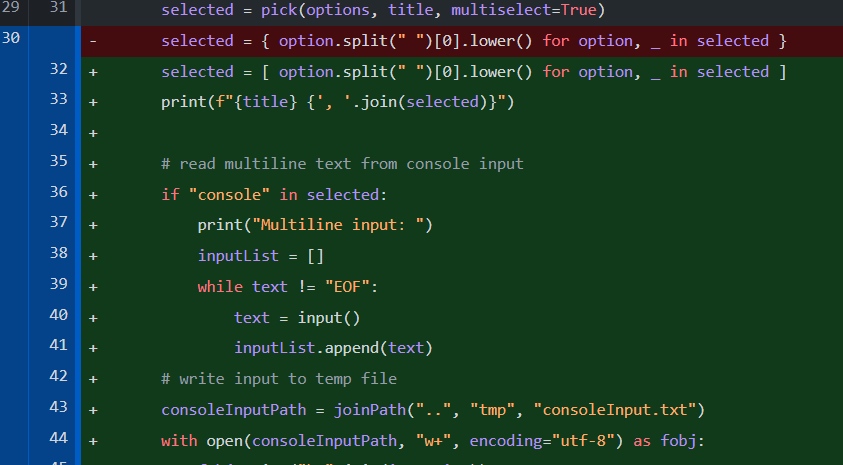
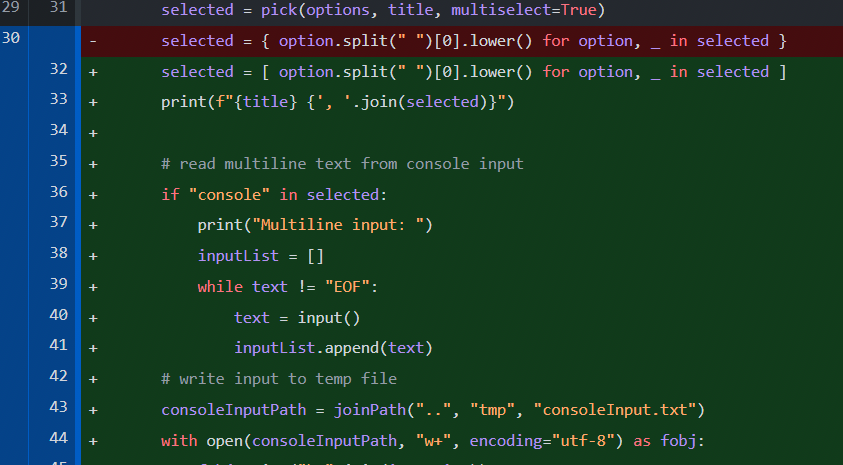

# Stenography Toolbox

A toolbox for steganography

## Demo

Input image:



Input Text:

```
dbkefnsd,
alles klappt 
😂
QUIT
EOF
```

Output Image:



Extrated Text:

[extracted.txt](test/extracted.txt)

```
dbkefnsd,
alles klappt 
😂
QUIT
EOF
dbkefnsd,
alles klappt 
😂
QUIT
EOF
dbkefnsd,
alles klappt 
😂
QUIT
EOF

...

```

