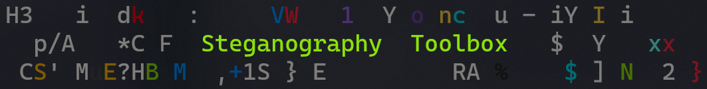

# 

A toolbox for steganography

## Demo

Console UI:


Input image:


Input Text:

```
dbkefnsd,
alles klappt 
😂
QUIT
EOF
```

Output Image:


Extrated Text:

[extracted.txt](test/extracted.txt)

```
dbkefnsd,
alles klappt 
😂
QUIT
EOF
dbkefnsd,
alles klappt 
😂
QUIT
EOF
dbkefnsd,
alles klappt 
😂
QUIT
EOF

...

```

