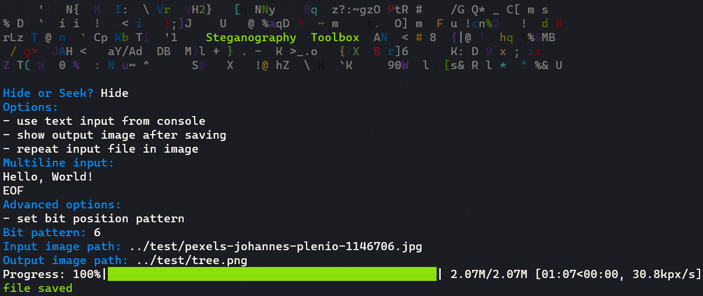
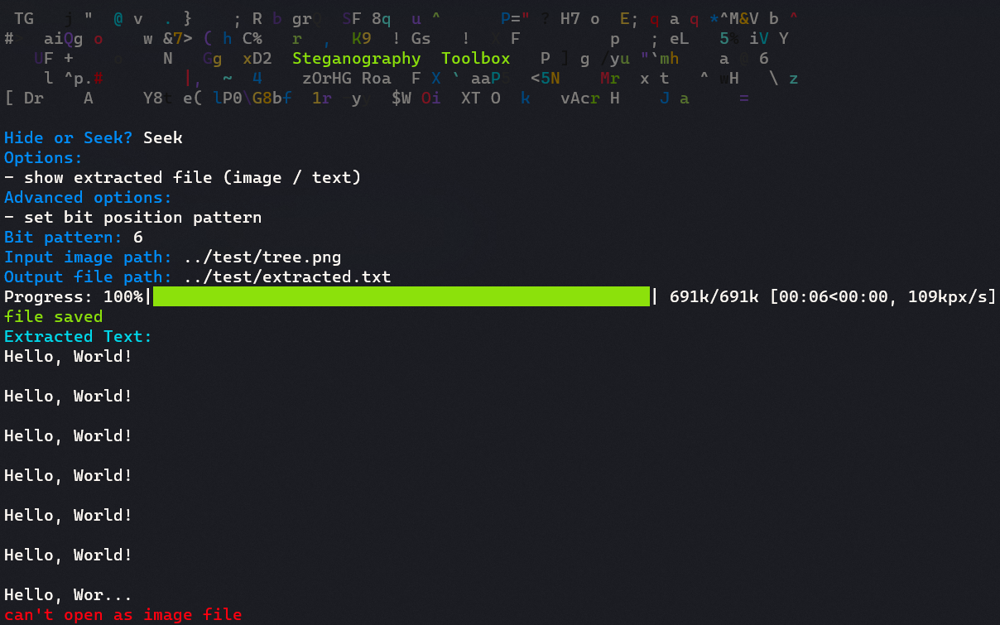

# 

A toolbox for steganography:

- [x] Hide file in image
- [ ] Hide file in audio

## Requirements

```
python -m pip install -r requirements.txt
```

## Demo

### Hide text in image



Input image:


Input text:

```
Hello, World!
EOF
```

Output image:




Extrated text:

[extracted.txt](test/extracted.txt)

```
Hello, World!

Hello, World!

Hello, World!

Hello, World!

Hello, World!

Hello, World!

Hello, Wor...
```
